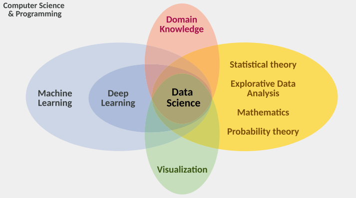
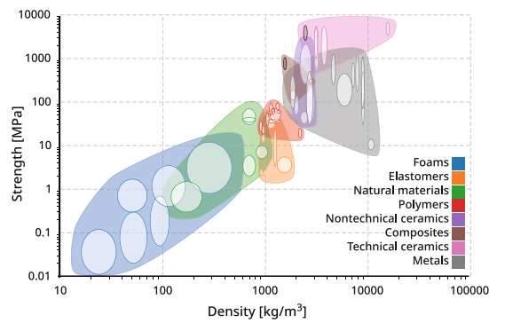
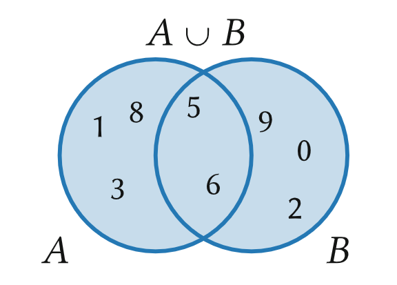
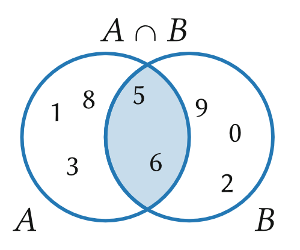
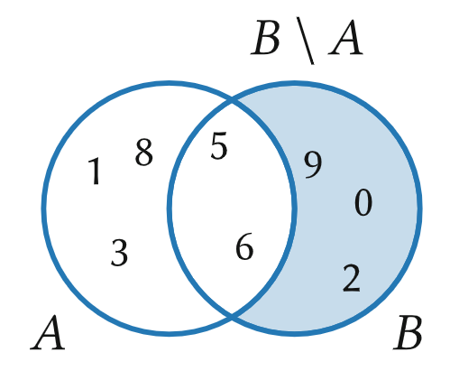

# Materi Pembelajaran Materials Data Science

## Daftar Isi
1. Sejarah Data dan Data Science
2. Data Science Menuju Material Data Science
3. Dasar Matematika dalam Data Science
4. Material Science Datasets dan Data Generation

## **1.  Sejarah Data dan Data Science**
### 1.1 Darimana Angka Datang?

Pada awal tahun 3400 sebelum masehi, Bangsa Sumeria telah memperkenalkan sistem angka yang ditulis pada lempengan tanah liat. Sekitar tahun 2000 sebelum masehi bangsa Babilonia membuat sistem angka desimal dan telah melakukan perhitungan pendekatan nilai phi (π ≈ 3.125). Pada tahun 300 sebelum masehi bangsa Babilonia juga menciptakan alat bernama *abacus* sebaga alat perhitungan. Walaupun angka romawi sudah ada pada tahun 1000 sebelum masehi, Eropa harus menunggu 2 abad lagi sebelum sistem angka Indo-Arab (yang digunakan saat ini).  Masih banyak penemuan angka lainnya seperti angka "0" dan sistem angka biner pertama. Sekarang kita akan membahas penggunaan angka selain jual beli seperti penggunaan angka dalam bidang astronomi dan memprediksi lintasan benda-benda di langit.

### 1.2 The Ancient Roots of Data Science

Bangsa Babilonia kuno telah melakukan segalanya yang berhubungan dengan ilmu data (Data Science). Data science tidak akan ada tanpa adanya perkembangan sejarah yang ada. Pada sesi ini akan dijelaskan bagaimana penemuan-penemuan angka yang ada

### 1.2.1 Bangsa Babilonia Kuno (1800-600 SM)

Ketika bangsa Babilonia mengamati langit malam, mereka mengenali ada dua jenis benda langit. Yang pertama adalah bintang yang bergerak dengan pola melingkar dan dapat berkelap kelip. Yang kedua adalah benda langit yang bergerak tidak beraturan dan dikenal sebagai gerak *retograd*. Bangsa Babilonia pada masanya hanya mengenali merkurius, venus, mars jupiter, saturnus, bulan dan bintang. Namun bangsa Babilonia tidak dapat menjelaskan pergerakan dari planet ini, sehingga mereka mengasumsikan bahwa planet tersebut dikendalikan oleh Dewa. Model pergerakan yang dibuat bangsa memiliki tujuan untuk menentukan kalender kapan untuk bertani, panen bahkan untuk pergi perang.  

### 1.2.2 Zaman Klasik Kuno (750-600 SM)

Setelah runtuhnya bangsa Babilonia pada 539 SM, Sebagian besar pengetahuan mereka hampir lenyap. Namun untungnya, beberapa ilmu pengetahuan tentang astronomi telah diteruskan ke orang Yunani. Anaximenes (±585–525 SM) membangun model kosmologi berdasarkan pemikiran Babilonia, tetapi tanpa melibatkan dewa-dewa. Ia memperkenalkan konsep setengah bola konsentris untuk menjelaskan pergerakan bintang dan planet, serta menciptakan unsur aether yaitu zat tak terlihat seperti kristal yang diyakini mendasari langit.

Sayangnya, Anaximenes tidak mampu menjelaskan gerak planet yang kompleks. Solusinya datang dari *Eudoxus of Cnidus* (±408–355 SM), murid Plato, yang  menambahkan banyak bola berputar. Bola tersbut di antaranya adalah 3 bola matahari dan bulan, serta 4 bola untuk masing-masing dari 5 planet. Kombinasi gerakan dari dua bola berbeda ini digunakan untuk menjelaskan gerak retrograd secara parsial. Secara keseluruhan, model ini memerlukan 27 bola langit. Aristoteles (384–322 SM) kemudian memperluas model ini menjadi 56 bola, karena hanya dengan cara itulah ia bisa menjelaskan variasi tingkat kecerahan bintang. Meskipun model ini terlihat canggih pada zamannya, dalam konteks pembelajaran mesin (machine learning) modern, pendekatan seperti ini dapat dianggap sebagai bentuk "overfitting". Artinya, model terlalu disesuaikan dengan data pengamatan sehingga kehilangan kemampuan untuk menyederhanakan atau menangkap pola yang lebih umum. Dengan kata lain, kompleksitas model tidak lagi mencerminkan pemahaman mendalam terhadap fenomena, melainkan hanya upaya memaksa kecocokan terhadap data yang ada.

Sayangnya, bahkan model-model sebelumnya belum mampu menjelaskan semua fenomena langit yang diamati, termasuk perubahan fase Bulan seperti bulan sabit dan purnama. Baru beberapa abad kemudian, ilmuwan Romawi Claudius Ptolemy (sekitar 100–170 M) muncul dengan gagasan baru, meskipun sebagian sudah pernah disebut oleh ilmuwan Yunani sebelumnya. Dalam modelnya, Ptolemy membayangkan bahwa planet-planet menempel pada semacam "roda langit" yang terhubung dengan bola-bola langit. Ia juga menempatkan Bumi dalam posisi sedikit tidak simetris (eksentris) terhadap pusat, sehingga planet-planet tampak bergerak dengan kecepatan berbeda. Model geosentris ini sangat kompleks, terdiri dari sekitar 80 elemen geometris seperti lingkaran dan bola, namun memiliki tingkat akurasi yang tinggi. Model ini mampu memprediksi fenomena seperti gerhana, dan Ptolemy juga menyusun tabel astronomi serta alat bantu lain untuk menghitung posisi Bulan, Matahari, dan planet-planet. Meskipun mengandung banyak asumsi fisika yang keliru dan sangat rumit, model ini menjadi standar tertinggi dalam astronomi selama lebih dari seribu tahun.

### 1.2.3 Zaman Medieval (500-1500)

Abad Pertengahan merupakan masa suram bagi masyarakat Eropa, termasuk bagi perkembangan ilmu pengetahuan. Kelaparan, perang, dan wabah penyakit menyebabkan penurunan drastis jumlah penduduk, termasuk para ilmuwan. Invasi dan migrasi besar-besaran menciptakan kondisi yang tidak kondusif bagi kemajuan ilmu. Di tengah keterpurukan itu, muncul Thomas Aquinas (1225–1274) sebagai salah satu pemikir cemerlang yang langka pada masanya. Ia mencoba menyelaraskan ilmu astronomi dengan ajaran teologi. Salah satu kontribusinya adalah merumuskan lima argumen untuk membuktikan keberadaan Tuhan. Hal ini mencerminkan semangat zaman tersebut yang masih sangat teologis. Namun, semua argumen tersebut kemudian dibantah oleh William of Occam, seorang filsuf yang dikenal dengan prinsip Occam’s Razor. Prinsip ini—yang akan dibahas lebih lanjut dan memiliki pengaruh penting dalam dunia ilmu data modern (data science), karena menekankan pentingnya kesederhanaan dalam membangun model atau penjelasan ilmiah.

### 1.2.4 Zaman Renaisans (Sekitar 1500-1700)

Pada tahun 1473-1543, Nicolaus Copernicus menolak model Ptolemy dan tidak percaya bahwa alam bekerja dengan seperti itu. Dia merubah konsep astronomi dengan meletakkan matahari sebaga pusat dari tata surya. Perubahan ini dikenal sebagai Revolusi Copernicus. Model Copernicus jauh lebih sederhana dalam menjelaskan gerak retrogad planet. Selanjutnya, pada tahun 1546-1601 terdapat ilmuwan astronomi bernama Tycho de Brahe yang menghabiskan banyak waktunya dalam mengobservasi bintang. Secara kebetulan, ia menyaksikan 2 peristiwa langit yang sangat langka yaitu sebuah nova pada tahun 1572 dan sebuah komet pada 1576. "Pencilan" ini dapat menjadi kontradiksi terhadap pemahamannya mengenai alam semesta, khususnya dengan konsep bola kristal (crystal spheres), karena komet tersebut dapat melintasi orbit planet-planet, sesuatu yang tidak seharusnya terjadi menurut model lama.

Johannes Kepler (1571–1630), mantan asisten Tycho de Brahe, dikenal sebagai salah satu tokoh paling menarik dalam sejarah sains karena pemikirannya yang kreatif, spiritual, dan akurat. Ia mengagumi kesederhanaan model heliosentris milik Copernicus dan menyempurnakannya dengan menyatakan bahwa orbit planet berbentuk elips, bukan lingkaran. Dari sini lahirlah tiga Hukum Kepler, yang hingga kini masih digunakan dalam astronomi modern. Kepler memperoleh sebagian besar data hasil pengamatan Brahe, khususnya tentang orbit planet Mars, dan menganalisisnya secara mendalam selama 25 tahun. Setelah membandingkan data tersebut dengan prediksi dari model Ptolemy dan Copernicus, ia menemukan perbedaan yang signifikan. Penghargaan Kepler terhadap ketelitian data Brahe akhirnya membawanya pada model baru, yaitu orbit elips planet-planet yang lebih sesuai dengan pengamatan nyata.

### Prinsip Occam

William dari Occam hidup pada tahun 1285 sampai 1347. Beliau terkenal dengan prinsip yang dia buat bernama *"principle of parsimony"*. Yang menyatakan bahwa 2 teori yang menjelaskan sebuah fenomena, sebaiknya memilih salah satu kemungkinan dengan angka yang terkecil dari "parameter". 

### 1.3 Data Scientist Pertama Kali

Salah satu orang bilang bahwa Kepler merupakan data scientist pertama. Adapun salah satu orang yang dapat disimpulkan sebagai orang pertama dalam data scientist. Johann Tobias Mayer (1723-1762), seorang astronomi. Mayer meneliti perilaku bulan, khususnya fenomena *libration*, yaitu getaran kecil yang menyebabkan bulan tidak sepenugnya diam terhadap bumi meskipun menghadap dengan sisi yang sama. Mayer melakukan pengukuran terhadap satu titik di permukaan Bulan dan menerapkannya ke dalam persamaan trigonometri yang bergantung pada tiga parameter tak diketahui: α, β, dan θ. Mayer memiliki data dari 27 hari pengamatan. Ia membaginya menjadi 27 persamaan dalam 3 kelompok dari 9 persamaaan, kemudian menjumlahkan tiap kelompok menjadi satu persamaan. Dengan cara ini, ia tetap mendapatkan tiga persamaan untuk tiga parameter. Mayer memilih pengelompokan berdasarkan nilai koefisien α, yang ia anggap paling penting. Kelompok pertama berisi sembilan persamaan dengan nilai α paling positif, kelompok kedua berisi nilai α paling negatif, dan sisanya dikelompokkan ketiga. Strategi ini bertujuan memaksimalkan kontras nilai α, agar hasil estimasi parameter menjadi lebih akurat. Ia percaya bahwa dengan sembilan pengamatan per parameter, maka akurasi pun menjadi sembilan kali lebih baik, meskipun asumsi ini keliru secara matematis dan baru dikoreksi kemudian oleh Laplace dan Gauss dengan teori kesalahan yang lebih akurat. Mayer telah mengedepankan prinsip yang masih relevan dalam data science modern: semakin banyak data yang digunakan, semakin baik model yang dihasilkan.

### 1.4 Asal-usul Ilmu Data yang Lebih Modern

Ilmu data (data science) sesungguhnya memiliki akar yang sangat tua. Sejak dahulu, manusia terdorong untuk memahami dan memprediksi berbagai fenomena serta mendukung pengambilan keputusan. Dorongan inilah yang menjadi dasar dari ilmu data modern dan tidak banyak berubah hingga hari ini. Oleh karena itu, ilmu data sangat erat kaitannya dengan perkembangan matematika dan statistik. Sejak paruh kedua abad ke-18, terjadi berbagai kemajuan penting yang meletakkan fondasi bagi data science modern. Salah satu tonggak utama adalah diperkenalkannya metode least squares oleh Adrien-Marie Legendre pada tahun 1805. Metode ini menjadi teknik penting dalam analisis data dan akan sering dijumpai dalam konteks machine learning. Perkembangan besar lainnya terjadi dalam teori peluang (probabilitas), khususnya melalui kontribusi Thomas Bayes pada pertengahan abad ke-19. Ia dikenal luas lewat Teorema Bayes, yang hingga kini menjadi dasar dalam banyak metode pembelajaran mesin (machine learning) berbasis probabilistik. Pada paruh pertama abad ke-19, konsep probabilitas dan statistik mulai banyak diterapkan dalam ilmu sosial, seperti analisis tingkat kematian atau angka kejahatan di berbagai wilayah geografis. Namun, akhir abad ke-19 dianggap sebagai tonggak utama statistik modern. Ilmuwan seperti Francis Galton memanfaatkan kemajuan dalam eksperimen ilmu alam yang semakin canggih, terstandardisasi, dan menghasilkan lebih banyak data. Tokoh penting lain adalah Karl Pearson, yang berkontribusi besar hingga dekade 1930-an. Ia dikenal sebagai pencetus deviasi standar dan koefisien korelasi, dua konsep statistik yang sangat fundamental hingga kini.

### 1.5 Data Science dan Machine Learning pada Abad ke-20

Istilah data science secara resmi dikenalkan oleh C.-F. Jeff Wu pada tahun 1985, yang mengusulkannya sebagai nama alternatif untuk statistik. Disebutkan bahwa dalam simposium statistik Jepang-Prancis kedua yang diadakan di Universitas Montpellier, Prancis pada tahun 1992, istilah data science mulai diterima secara luas sebagai sebuah disiplin baru. Sejak saat itu, berkembang pula perdebatan panjang tentang apakah data science hanyalah nama lain dari statistik, atau apakah data science bisa berdiri sendiri tanpa mengandalkan statistik sama sekali—perdebatan yang hingga kini masih belum sepenuhnya selesai.

Terkait erat dengan data science adalah istilah data mining, yang pertama kali muncul pada tahun 1999 dalam artikel “Mining Data for Nuggets of Knowledge.” Artikel ini mengumumkan kursus singkat executive education mengenai data mining yang diselenggarakan oleh Jacob Zahavi. Di sana disebutkan bahwa metode statistik tradisional cocok untuk dataset kecil, sedangkan data mining memerlukan alat khusus untuk menangani dataset besar. Sejak itu, data mining dikenal sebagai proses untuk menemukan struktur dan pola dalam kumpulan data yang besar—definisi yang masih relevan hingga kini, terutama dengan semakin kuatnya metode machine learning.

Dengan kemajuan pesat dalam metode machine learning, ketersediaan infrastruktur CPU/GPU berperforma tinggi dengan harga terjangkau, serta hadirnya pustaka perangkat lunak (software libraries) yang mempermudah akses terhadap teknik-teknik canggih, maka data science semakin berkembang pesat. Fenomena ini kerap disebut sebagai “demokratisasi AI”, di mana teknologi canggih kini dapat diakses oleh hampir semua kalangan. Inilah yang membawa ilmu data ke posisi penting yang kita kenal saat ini.

## **2. Data Science Menuju Material Data Science**
### 2.1 Apa itu Data Science dan mengapa berhubungan dengan Machine Learning dan Artificial Intelligence?
### 2.1.1 Data Science

Seperti yang kita tahu, data science terdiri atas berbagai bidang seperti statistics, machine learning, data processing, dan lain sebagainya. Walaupun metode machine learning dan deep learning efektif dalam data science, tidak berarti perlu digunakan. Meskipun begitu, akar dari data science berada di statistika yang sudah disertai analisis data eksploratif selama beberapa dekade.

Seperti gambar yang diberikan, pendekatan dan *tools* dari computer science dan programming adalah bagian penting dari data science. Walaupun "programming" dapat berubah seiring berjalannya waktu dengan sistem seperti ChatGPT atau pendekatan graphical programming, menulis dan menggunakan kembali code dan *library* mungkin adalah cara paling edukatif untuk memecahkan masalah menggunakan pendekatan data science.

Lalu apa hubungannya dengan Artificial Intelligence?

### 2.1.2 Hubungan dengan Artificial Intelligence
Metode AI adalah meniru perilaku manusia yang membutuhkan skill kognitif seperti *Reasoning* dan *logic*. Selain itu, komponen penting lainnya adalah kemampuan untuk berinteraksi dengan *environment* (konteks, dll.). "Berinteraksi" mencakup mengenali *environment* dan beraksi sesuai *environment* tersebut. AI bukan berarti program tersebut cerdas dengan arti yang sama seperti manusia. Program tersebut cukup dapat menyelesaikan tugas atau masalah dengan cara yang memerlukan perilaku cerdas.

Bagaimana dengan ML yang fokus mempelajari algoritma berdasarkan *example* data? Miskonsepsi umum bahwa ML dianggap spesialisasi AI. Nyatanya, ML adalah salah satu cara untuk AI mencapai tujuannya. Walaupun *Reasoning* dan *logic* merupakan aspek penting dalam AI, bukanlah bagian dari ML.

### 2.1.3 Dari Machine Learning Menjadi Deep Learning
Deep Learning adalah spesialisasi lebih dalam Machine Learning yang menggunakan model ML tertentu, yaitu *deep neural network* terinspirasi dari struktur dan fungsi otak manusia. "Deep" berasal dari banyaknya layer *artificial neuron* di jaringan (100 atau lebih), berbeda dengan *shallow neural network* yang hanya memiliki beberapa layer. Tentunya, metode DL berkontribusi kepada AI, tetapi DL sendiri bukanlah AI.

### 2.1.4 Domain Knowledge
Salah satu komponen penting data science yang sering diabaikan adalah domain knowledge. Sebagian besar pertanyaan data science berasal dari masalah spesifik, seperti masalah scientific, technological, ataupun societal dengan harapan jawaban dan wawasan baru.

### 2.2 Data Science dan Machine Learning dalam Materials Science and Engineering
Materials data science merupakan pengaplikasian pendekatan data science ke maslah materials science atau menghubungkan solusi berbasis data terhadap spesifikasi masalah tersebut.

### 2.2.1 Materials Data Science Tanpa Machine Learning?
Salah satu contoh dalam materials science yang dikenal adalah *material property charts* yang juga dikenal sebagai *Ashby Map*.

Diagram scatterplot ini memetakan dua sifat material pada dua sumbu dan mengkategorikan setiap titik dengan menetukan kelas materialnya sebagai warna titik tersebut. Kemudian klaster titik tersebut dikelompokkan dan digambarkan sebagai area berwarna.

Diagram tersebut dapat merepresentasikan raw data dan juga "menyaring" dan memvisualisasi pola-pola tertentu dalam data. Ashby telah memilih pasangan sifat paling penting seperti Young's modulus vs density atau strenght vs density dimana dalam *engineering proses design*, kualitas pertama dimaksimalkan dan kedua diminimalisir. Dalam konteks ML, hal ini disebut *feature engineering*. Didukung juga oleh skala logaritmik ganda pada sumbu untuk memperlihatkan detail pada skala yang berbeda.

### 2.2.2 Ringkasan Singkat Machine Learning di Materials Science
Sejalan dengan berbagai aspek digitalisasi, data science dapat menjadi sarana untuk mengubah data riset menjadi "pengetahuan" yang berharga. Hal ini tercerminkan dalam program pendanaan lembaga-lembaga pendanaan yang telah memunculkan inisiatif-inisiatif baru yang menangani manajemen riset data dan analisis data untuk memulai perubahan *non-incremential* dalam cara penelitian ilmiah dilakukan.

Bidang desain material komputasi high-throughput berpatsipasi dalam mewujudkan database besar yang berisi sifat termodinamika dan sifat elektronik yang dihitung, serta menganalisis dengan metode statistik dan ML. *Interatomic potentials* (potensial antar-atom) dalam simulasi atomistik juga memiliki pengaplikasian ML. Potensial ini merupakan komponen penting dalam simulasi atomistik dan potensial harus dievaluasi setiap atom. Dengan memanfaatkan potensial berbasis ML, kinerja menjadi lebih cepat dengan menghasilkan dataset dengan kualitas tinggi dan akurat secara kimia dibandingkan dengan perhitungan teori fungsi kerpatan. Hal ini memungkinkan untuk simulasi sistem yang lebih besar.

Metode simulasi mesoscale, simulasi *defects*, dan komunitas *microscopy* juga mendapatkan pengaruh dari analisis berbasis ML. Perkembangan *convoluted neural networks* dan *generative adversarial networks* telah memulai revolusi di bidang analisis gambar. Dengan pengaplikasiannya dari *image denoising* and *restoration* sampai *resolution echancement* dan *feature tracking*. Salah satu contoh hubungan metode analisis untuk data mining gambar *microscopy* dapat merujuk ke buku [Materials Data Science] atau jurnal dan paper terkait [[1-4]](#bahan-bacaan).

### 2.3 Dari Data dan Informasi menjadi Pengetahuan
### 2.3.1 "Data Information" dari Sudut Pandang Information Science
### 2.3.2 "Data Information" dari Sudut Pandang Data Science

### 2.4 Kutukan Dimensionality
### 2.5 Kesimpulan

### 3 Dasar Matematika dalam Data Science

### 3.1 Aturan dan Notasi Dasar

Berikut merupakan pengertian definisi yang ada dalam matematika dan contoh penulisannya :

1. Skalar = besaran yang hanya memiliki nilai (magnitudo), tanpa arah. Contoh penulisan :
- λ = 2
- *a* = 2.453

2. Vektor = besaran yang memiliki nilai dan arah. Contoh penulisan :
- σ = [0.5, 0.4, 0.9]

3. Matriks = susunan angka, simbol, atau ekspresi dalam bentuk baris dan kolom. Contoh penulisan ditulis dengan huruf kapital, dan huruf latin yang di-bold :
$$
\mathbf{A} = \begin{bmatrix}
1 & 2 & 3 \\
4 & 5 & 6 \\
7 & 8 & 9
\end{bmatrix}
$$

4. Bilangan Real dan bilangan integer dinotasikan sebgai ℝ and ℤ. Sedangkan bilangan natural dinotasikan sebagai ℕ yang merupakan kumpulan dari bilangan integer positif

5. **Fungsi** bergantung pada variabel yang digunakan. Dalam bentuk *f(x)*, yang merupakan fungsi adalah *f* dan *x* sebagai variabel. Untuk memberikan. Untuk memberikan parameter spesifik seperti konstanta, ditulis dengan semicolon(;). Misal kita punya 1 variabel x dan 2 konstanta p1 dan p2. Maka penulisannya seperti berikut :

$$
f(x;\ p_1, p_2) = p_1 + p_2 x^2 \quad \text{dengan} \quad p_1 = 0.5 \quad \text{dan} \quad p_2 = 2.0.
$$

6. Macam-macam kurung dan penggunaannya seperti pada tabel berikut :

| Simbol    | Nama (Bahasa Indonesia) | Fungsi Utama                                               |
|-----------|--------------------------|-------------------------------------------------------------|
| `()`      | Kurung biasa / bulat     | Mengelompokkan operasi matematika, pemanggilan fungsi, penjelasan teks |
| `[]`      | Kurung siku              | Notasi matriks, indeks array/list, sisipan teks            |
| `{}`      | Kurung kurawal           | Himpunan matematika, blok kode dalam pemrograman           |
| `<>` / `〈〉` | Kurung sudut / chevron     | Produk dalam (inner product), template C++, tag HTML/XML   |

7. **Kode Python** ditulis dengan latar belakang abu-abu terang, misalnya:  
`print('x =', x)`

### 3.2 Set, Tuplet, Vektor dan Array

### 3.2.1 Set

Dalam matematika set atau himpunan  merupakan kumpulan data yang tidak terstruktur dari element yang berbeda tanpa pengulangan. Element dapat berupa angka, variabel, simbol, bahkan himpunan lainnya. Misalnya kita memiliki himpunan A yang terdiri dari anggka 1, 2, 3,4 dan 5. Maka dapat ditulis sebagai berikut :

`A = {1, 2, 3, 4, 5}`

Set juga dapat menjelaskan sifat element dari sebuah set. Contohnya adalah n merupakan kumpulan angka integer ganjil dari rentang 1 sampai 10. Maka dapat ditulis :

$$
S = {n | n ∈ ℕ\text{, n merupakan angka ganjil, } 1 \leq n \leq 10}
$$

Dalam penulisan di pemrograman python. Set dapat dituliskan sebagai berikut : 

`set([3, 4, 5])` 

### Operasi Himpunan/Set

Operasi himpunan dapat digambarkan dalam bentuk diagram venn. Dengan mengasumsikan *A* dan *B* merupakan himpunan. Berikut operasi yang ada dalam himpunan :

1. Gabungan (Union)

Gabungan (Union) merupakan operasi himpunan yang menggabungkan semua elemen dari dua atau lebih himpunan tanpa adanya elemen yang sama yang ditulis berulang. Misal kita punya himpunan `A = {1, 3, 5, 6, 8}` dan `B = {0, 2, 5, 6, 9}`. Maka `A ∪ B = {0, 1, 2, 3, 5, 6, 8, 9}`. Berikut contoh gambarnya dalam bentuk diagram venn :

2. Irisan (Intersection)

Irisan adalah operasi pada himpunan yang menghasilkan himpunan baru yang berisi elemen-elemen yang terdapat pada kedua himpunan secara bersamaan.. Misal kita punya himpunan `A = {1, 3, 5, 6, 8}` dan `B = {0, 2, 5, 6, 9}`. Maka `A ∩ B = {0, 1, 2, 3, 5, 6, 8, 9}`. Berikut contoh gambarnya dalam bentuk diagram venn :

3. Selisih Nilai (Difference)

Selisih Nilai himpunan adalah operasi yang menghasilkan himpunan baru yang berisi elemen-elemen yang ada di himpunan pertama tetapi tidak ada di himpunan kedua. Misal kita punya himpunan `A = {1, 3, 5, 6, 8}` dan `B = {0, 2, 5, 6, 9}`. Maka `B \ A = {9, 0, 2}`. Berikut contoh gambarnya dalam bentuk diagram venn :

## Bahan Bacaan
1. [Dokumentasi Materials Data Science](https://awan.brin.go.id/s/LHkfZ5e6mgk6cX4)
2. [UMAP: Uniform Manifold Approximation and Projection](10.21105/joss.00861)
3. [Automated analysis of X-ray topography of 4H-SiC wafers](doi.org/10.1557/s43578-022-00880-z)
4. [Combining unsupervised and supervised learning in microscopy enables defect analysis of a full 4H-SiC wafer](https://doi.org/10.48550/arXiv.2402.13353)

---
*Kembali ke [Daftar Tutorial](https://github.com/BRIN-Q/tacit-knowledge)*

