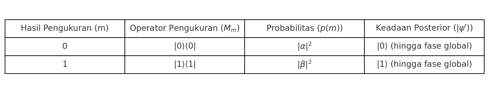

---
---
---

    <h1 style="font-size: 45px; font-family: 'Segoe UI', Tahoma, Geneva, Verdana, sans-serif; color: #e63946; background: linear-gradient(45deg, #e63946, #1d3557); -webkit-background-clip: text; color: transparent; padding: 20px 40px; border: 4px solid transparent; border-radius: 12px; background-image: linear-gradient(45deg, #e63946, #1d3557);">
        Quantum Mechanics Distilled
    </h1>

---
---
---

 
 

# PART 1 : Postulat Mekanika Kuantum

## **Pendahuluan** : Memahami Kerangka Mekanika Kuantum

Mekanika Kuantum (MK) bukanlah sebuah teori fisika tunggal yang lengkap, melainkan sebuah kerangka matematis fundamental yang menyediakan aturan dan struktur untuk menggambarkan perilaku sistem fisik pada skala atomik dan sub-atomik. Kerangka ini berfungsi sebagai "bahasa" atau "sintaks" universal yang memungkinkan para fisikawan untuk merumuskan teori-teori yang lebih spesifik mengenai interaksi partikel dan energi.   

Untuk lebih mudah memahami peran Mekanika Kuantum, kerangka ini dapat dianalogikan dengan sistem operasi (OS) pada sebuah komputer. Sebuah OS menyediakan fungsi-fungsi dasar yang esensial, seperti manajemen memori, penjadwalan proses, dan input/output. Namun, OS itu sendiri tidak secara langsung melakukan tugas-tugas spesifik seperti mengolah kata, menjelajahi web, atau mengedit gambar. Untuk melakukan fungsi-fungsi tersebut, diperlukan "aplikasi perangkat lunak" tambahan yang dibangun di atas OS.   

Demikian pula, Mekanika Kuantum membutuhkan "aplikasi" atau teori fisika tambahan untuk mendeskripsikan sistem fisik tertentu secara detail. Sebagai contoh, untuk menggambarkan atom dan interaksinya dengan cahaya secara kuantum, diperlukan teori yang lebih spesifik seperti *Quantum Electrodynamics* (QED). Sementara itu, untuk memahami partikel fundamental seperti *quark* atau *boson Higgs*, Model Standar Fisika Partikel menjadi "aplikasi" yang relevan. Teori-teori tambahan inilah yang menyediakan detail spesifik mengenai ruang keadaan dan operator yang relevan untuk sistem yang sedang ditinjau.   

Sifat Mekanika Kuantum sebagai kerangka kerja ini menyoroti dualitas fundamental dalam fisika modern: universalitas prinsip-prinsip kuantum dan spesifisitas interaksi fundamental. Postulat-postulat Mekanika Kuantum menyediakan fondasi aksiomatik yang berlaku untuk semua sistem kuantum, mulai dari qubit terkecil hingga atom, dan bahkan alam semesta itu sendiri. Namun, detail bagaimana prinsip-prinsip ini termanifestasi dalam sistem tertentu. Misalnya, bentuk pasti dari ruang keadaan atau operator yang relevan, memerlukan teori-teori yang lebih spesifik. Hal ini membedakan Mekanika Kuantum dari teori-teori klasik seperti mekanika Newton atau elektromagnetisme Maxwell yang, dalam lingkupnya, seringkali dianggap sebagai deskripsi yang lengkap dari fenomena yang mereka jelaskan. Pendekatan ini memungkinkan fleksibilitas dan skalabilitas, di mana prinsip-prinsip dasar tetap konsisten sementara model-model yang lebih rinci dapat dikembangkan untuk berbagai domain fisika.

## **Postulat 1** : Ruang Keadaan (*State Space*)

Postulat pertama Mekanika Kuantum menyatakan bahwa setiap sistem fisik diasosiasikan dengan sebuah ruang vektor kompleks yang dikenal sebagai ruang keadaan. Jika sistem tersebut terisolasi (tidak berinteraksi dengan sistem lain), keadaannya dapat dijelaskan sepenuhnya oleh sebuah vektor keadaan (sering dilambangkan dengan $∣ψ⟩$), yang merupakan vektor satuan dalam ruang keadaan sistem tersebut.   

- **Ruang Vektor Kompleks** Bayangkan ini sebagai "peta" matematis di mana semua kemungkinan "lokasi" atau "keadaan" yang bisa dimiliki sebuah partikel kuantum berada. "Kompleks" berarti koordinatnya bisa berupa bilangan kompleks (memiliki bagian nyata dan imajiner), yang penting untuk menggambarkan sifat gelombang partikel.

- **Vektor Keadaan ($∣ψ⟩$)** Ini adalah "alamat" spesifik partikel di peta tersebut, yang mengandung semua informasi yang mungkin tentang partikel itu pada waktu tertentu.   

- **Vektor Satuan** Properti "vektor satuan" berarti panjang atau norma dari vektor keadaan tersebut adalah 1. Ini adalah aspek krusial karena memastikan bahwa probabilitas dari semua kemungkinan hasil pengukuran dalam basis komputasi (atau basis pengukuran lainnya) akan selalu berjumlah 1 (atau 100%). Ini merupakan prinsip konservasi probabilitas yang fundamental dalam Mekanika Kuantum.   

Postulat ini memiliki cakupan aplikasi yang sangat luas, berlaku untuk spektrum sistem fisik yang sangat beragam, mulai dari entitas terkecil seperti qubit (bit kuantum) hingga atom, molekul, bahkan sistem makroskopis seperti manusia, dan secara konseptual, seluruh alam semesta. Sebagai contoh ilustratif, untuk sebuah qubit, ruang keadaannya adalah ruang vektor kompleks dua dimensi. Vektor keadaannya adalah vektor satuan di ruang ini, yang sering direpresentasikan dalam bentuk superposisi sebagai :
$$
∣ψ⟩ = α∣0⟩ + β∣1⟩
$$
Dalam representasi ini, $∣0⟩$ dan $∣1⟩$ adalah keadaan dasar (seperti "0" dan "1" pada bit klasik), dan $α$ serta $β$ adalah bilangan kompleks yang disebut amplitudo probabilitas. Properti vektor satuan dan konservasi probabilitas ditegaskan kembali oleh kondisi normalisasi:
$$
∣α∣² + ∣β∣² = 1    
$$

- **Superposisi** Ini adalah konsep di mana partikel kuantum dapat berada dalam beberapa keadaan sekaligus sebelum diukur. Analogi sederhana: bayangkan sebuah koin yang sedang berputar di udara. Sebelum jatuh, koin itu tidak "kepala" atau "ekor" secara pasti, melainkan "kombinasi" dari keduanya. Hanya ketika koin itu mendarat (diukur), barulah kita mendapatkan hasil pasti (kepala atau ekor).   

Namun, penting untuk dipahami bahwa Mekanika Kuantum sebagai kerangka kerja tidak secara spesifik menentukan ruang keadaan yang tepat untuk sistem fisik tertentu. Penentuan ini harus dilakukan berdasarkan kasus per kasus, seringkali dengan bantuan teori fisika tambahan. Misalnya, untuk mendeskripsikan atom dan interaksinya dengan cahaya secara kuantum, diperlukan teori seperti *Quantum Electrodynamics* (QED), yang menyediakan keadaan dan ruang keadaan spesifik yang relevan. Demikian pula, untuk partikel fundamental seperti *quark* atau *boson Higgs*, Model Standar Fisika Partikel yang menyediakan ruang keadaan dan vektor yang diperlukan.   

Postulat pertama secara eksplisit menekankan bahwa sistem harus terisolasi agar keadaannya dapat dijelaskan sepenuhnya oleh vektor keadaannya. Sebuah sistem terisolasi didefinisikan sebagai sistem yang tidak berinteraksi dengan sistem lain. Implikasi dari persyaratan ini sangat mendalam. Sebagian besar sistem fisik di dunia nyata tidaklah terisolasi, mereka terus-menerus berinteraksi dengan lingkungannya. Akibatnya, sistem-sistem ini umumnya tidak memiliki keadaan kuantumnya sendiri yang dapat dijelaskan secara independen oleh satu vektor keadaan. 

Contoh penting dari hal ini adalah keadaan keterikatan (***entanglement***) dari dua qubit, di mana tidak ada qubit individual yang memiliki keadaan kuantum yang masuk akal secara mandiri. Sebaliknya, hanya keadaan gabungan dari kedua qubit tersebut yang relevan dan dapat dijelaskan.   

- **Keterikatan (***Entanglement***)** Fenomena di mana dua atau lebih partikel terhubung sedemikian rupa sehingga keadaan satu partikel tidak dapat dijelaskan secara terpisah dari partikel lainnya, bahkan jika mereka berjauhan. Analogi: bayangkan dua koin ajaib yang selalu mendarat berlawanan (satu kepala, satu ekor), tidak peduli seberapa jauh jaraknya. Jika Anda melihat satu koin dan itu kepala, Anda langsung tahu koin yang lain pasti ekor, tanpa perlu melihatnya.   

Kebutuhan akan sistem terisolasi ini menyoroti salah satu tantangan utama dalam menerapkan Mekanika Kuantum pada sistem makroskopis atau sistem yang berinteraksi kuat dengan lingkungannya, sebuah fenomena yang dikenal sebagai dekoherensi. Interaksi yang konstan dengan lingkungan secara efektif "mengukur" keadaan sistem, menyebabkannya kehilangan sifat-sifat kuantumnya seperti superposisi dan entanglement, dan membuatnya tampak berperilaku secara klasik. Konsep ini secara implisit memperkenalkan fenomena entanglement sebagai situasi di mana bagian-bagian dari sistem tidak dapat dijelaskan secara independen, meskipun **Postulat 4** akan secara eksplisit mendefinisikan bagaimana sistem komposit dibentuk. Oleh karena itu, postulat ini tidak hanya mendefinisikan dasar representasi keadaan, tetapi juga memberikan petunjuk mengapa fenomena kuantum tidak mudah diamati pada skala makroskopis dalam kehidupan sehari-hari.   

## **Postulat 2** : Dinamika Uniter (*Unitary Dynamics*)

Postulat kedua Mekanika Kuantum menjelaskan bagaimana keadaan sistem kuantum berevolusi seiring waktu. Dinyatakan bahwa evolusi sistem kuantum yang terisolasi dijelaskan oleh sebuah matriks uniter ($U$) yang bekerja pada ruang keadaan sistem. Jika keadaan sistem pada waktu $t$1 adalah $∣ψ⟩$, maka keadaan sistem pada waktu $t$2 yang lebih lambat, yang dilambangkan sebagai $∣ψ'⟩$, diberikan oleh persamaan :
$$
∣ψ'⟩ = U ∣ψ⟩
$$

Matriks $U$ ini bergantung pada selang waktu antara $t$1 dan $t$2, tetapi tidak bergantung pada keadaan kuantum itu sendiri.   

- **Matriks Uniter** Ini adalah jenis matriks khusus yang, ketika diterapkan pada vektor, tidak mengubah panjang (norma) vektor tersebut. Analoginya seperti memutar atau mencerminkan sebuah objek, bentuk dan ukurannya tetap sama, hanya orientasinya yang berubah.

Pentingnya matriks uniter terletak pada properti fundamentalnya. Mereka mempertahankan panjang (norma) dari vektor keadaan kuantum. Konservasi norma ini sangat krusial karena memastikan bahwa total probabilitas dari semua kemungkinan hasil pengukuran akan selalu berjumlah satu. Jika norma vektor keadaan tidak dipertahankan selama evolusi, maka total probabilitas bisa menjadi lebih dari 1 (yang berarti hasil yang lebih mungkin dari 100%) atau kurang dari 1 (yang berarti probabilitas tidak lengkap), keduanya secara fisik tidak masuk akal. Ini menunjukkan hubungan yang erat dan konsisten antara postulat-postulat Mekanika Kuantum.   

Contoh paling langsung dari penerapan postulat ini dapat ditemukan dalam komputasi kuantum, di mana gerbang kuantum seperti gerbang *Pauli X* (analog dengan gerbang NOT klasik) dan gerbang *Hadamard* adalah contoh konkret dari operasi uniter. Gerbang-gerbang ini mengubah keadaan qubit sambil tetap mempertahankan sifat-sifat kuantumnya.

Mirip dengan Postulat 1, Postulat 2 juga merupakan kerangka umum dan tidak secara spesifik menentukan transformasi uniter mana yang diperlukan untuk situasi fisik tertentu. Penentuan matriks $U$ yang relevan untuk evolusi sistem spesifik juga ditentukan oleh teori-teori tambahan seperti *Quantum Electrodynamics* (QED) atau Model Standar Fisika Partikel.   

Meskipun postulat ini secara langsung berlaku untuk sistem terisolasi, dalam praktiknya, sistem yang tidak terisolasi juga dapat dijelaskan oleh dinamika uniter efektif melalui desain eksperimen yang cermat. Misalnya, sebuah atom yang berinteraksi dengan laser untuk melakukan gerbang kuantum dapat dianggap sebagai sistem terisolasi yang lebih besar (atom + laser) atau interaksi dengan lingkungan yang tidak relevan dapat diabaikan dalam model tertentu.   

Postulat 2 juga memiliki hubungan yang erat dengan **Persamaan Schrödinger**, yang menyediakan deskripsi waktu kontinu dari dinamika keadaan kuantum. Persamaan Schrödinger ditulis sebagai :
$$
i\hbar\frac{d}{dt}|\psi\rangle = H|\psi\rangle
$$
Di sini, $\hbar$ adalah konstanta Planck tereduksi (sebuah konstanta fundamental dalam fisika kuantum), dan $H$ adalah matriks Hermitian tetap yang disebut Hamiltonian sistem. Hamiltonian mewakili energi total sistem dan merupakan operator yang menentukan bagaimana sistem berevolusi seiring waktu. Persamaan ini sepenuhnya konsisten dengan Postulat 2, karena solusinya untuk evolusi dari waktu $t$1 ke $t$2 adalah sebagai berikut :
$$
|\psi_{t_2}\rangle = e^{-iH(t_2-t_1)/\hbar}|\psi_{t_1}\rangle
$$
Ini menunjukkan bahwa operator evolusi waktu $U = e^{-iH(t_2-t_1)/\hbar}$ adalah matriks uniter.   

- **Hamiltonian ($H$)** Ini adalah "mesin" matematis yang menggambarkan total energi sistem (energi kinetik + energi potensial) dan bagaimana energi itu mendorong perubahan keadaan sistem seiring waktu.

- **Matriks Hermitian** Ini adalah jenis matriks khusus yang memiliki nilai eigen (nilai terukur) yang selalu nyata (bukan bilangan kompleks). Sifat Hermitian dari Hamiltonian sangat penting karena menjamin bahwa nilai eigen (energi yang mungkin) adalah riil dan bahwa evolusi waktu yang dihasilkannya adalah uniter, yang pada gilirannya memastikan konservasi probabilitas.   

Sifat uniter dari evolusi waktu adalah manifestasi matematis dari konservasi probabilitas dalam sistem kuantum. Jika probabilitas tidak dijaga, sistem akan "menghilang" atau "muncul" dari ketiadaan, yang jelas melanggar prinsip-prinsip fisika dasar. **Hamiltonian sebagai generator evolusi waktu, harus Hermitian untuk memastikan bahwa evolusi yang dihasilkannya adalah uniter, dan dengan demikian, probabilitas total selalu terjaga**. 

Ini adalah jembatan yang kuat antara aljabar linear dan fisika fundamental. Konservasi probabilitas adalah salah satu prinsip paling mendasar dalam fisika, dan postulat-postulat Mekanika Kuantum secara elegan mengintegrasikannya melalui properti matriks uniter dan operator Hermitian, menunjukkan bagaimana struktur matematis MK secara intrinsik dibangun untuk menjaga konsistensi fisik.

## **Postulat 3** : Pengukuran (*Measurement*)

Postulat ketiga adalah salah satu aspek paling unik dan seringkali membingungkan dari Mekanika Kuantum, karena ia menjelaskan bagaimana kita memperoleh informasi dari sistem kuantum dan bagaimana keadaan sistem berubah setelah interaksi pengukuran. Pengukuran kuantum dijelaskan oleh kumpulan operator pengukuran {$M_m$}, yang merupakan matriks yang bekerja pada ruang keadaan sistem. Indeks 'm' dalam {$M_m$} sesuai dengan kemungkinan hasil pengukuran yang dapat diperoleh.   

Jika keadaan sistem sebelum pengukuran adalah $∣ψ⟩$, probabilitas untuk mendapatkan hasil 'm' tertentu diberikan oleh rumus :
$$
p(m)=⟨ψ∣Mm†Mm∣ψ⟩    
$$
Setelah pengukuran dilakukan dan hasil 'm' diperoleh, keadaan sistem akan berubah secara instan ke keadaan posterior yang baru, yang diberikan oleh :
$$
|\psi'\rangle = \frac{M_m|\psi\rangle}{\sqrt{\langle\psi|M_m^\dagger M_m|\psi\rangle}}
$$

Penyebut ${\sqrt{\langle\psi|M_m^\dagger M_m|\psi\rangle}}$ adalah akar kuadrat dari probabilitas $p(m)$, dan fungsinya adalah untuk menormalisasi keadaan posterior sehingga menjadi vektor satuan, konsisten dengan Postulat 1.   

Operator pengukuran harus memenuhi sebuah kondisi penting yang disebut **relasi kelengkapan** :
$$
\sum_m M_m^\dagger M_m = I
$$ 
Di mana $I$ adalah matriks identitas. Relasi ini memastikan bahwa jumlah probabilitas dari semua kemungkinan hasil pengukuran yang mungkin adalah 1, sekali lagi menegaskan prinsip konservasi probabilitas.   

Untuk memberikan contoh yang lebih konkret, mari kita tinjau pengukuran basis komputasi pada sebuah qubit. Misalkan sebuah qubit berada dalam keadaan superposisi $α∣0⟩+β∣1⟩$. Pengukuran dalam basis komputasi (basis standar $∣0⟩,∣1⟩$) menggunakan dua operator pengukuran, yaitu :

$M_0 = |0\rangle\langle0|$ (operator proyeksi untuk hasil 0)

$M_1 = |1\rangle\langle1|$ (operator proyeksi untuk hasil 1)    

Menggunakan operator ini, probabilitas untuk mendapatkan hasil 0 adalah:

$$
p(0) = \langle\psi|M_0^\dagger M_0|\psi\rangle = \langle\psi|0\rangle\langle0|\psi\rangle = |\langle0|\psi\rangle|^2 = |\alpha|^2
$$

Dan probabilitas untuk mendapatkan hasil 1 adalah:

$$
p(1) = \langle\psi|M_1^\dagger M_1|\psi\rangle = \langle\psi|1\rangle\langle1|\psi\rangle = |\langle1|\psi\rangle|^2 = |\beta|^2
$$

Setelah pengukuran, keadaan posterior sistem akan berubah. Jika hasil 0 diperoleh, keadaan posteriornya adalah :

$
|\psi'\rangle = \frac{M_0|\psi\rangle}{\sqrt{p(0)}} = \frac{|0\rangle\langle0|(\alpha|0\rangle+\beta|1\rangle)}{|\alpha|} = \frac{\alpha|0\rangle}{|\alpha|} = |0\rangle
$ (hingga faktor fase global)    

Jika hasil 1 diperoleh, keadaan posteriornya adalah :

$|\psi'\rangle = \frac{M_1|\psi\rangle}{\sqrt{p(1)}} = \frac{|1\rangle\langle1|(\alpha|0\rangle+\beta|1\rangle)}{|\beta|} = \frac{\beta|1\rangle}{|\beta|} = |1\rangle$ (hingga faktor fase global)    

Tabel berikut merangkum operator, probabilitas, dan keadaan posterior untuk pengukuran basis komputasi pada qubit :

*Tabel 1: Operator Pengukuran Basis Komputasi pada Qubit*

Penting untuk dicatat bahwa keadaan kuantum yang hanya berbeda oleh faktor fase global (misalnya, $|\psi'\rangle = e^{i\theta}|\psi\rangle$) dianggap identik secara fisik. Ini karena faktor fase global tidak memengaruhi probabilitas pengukuran ($p(m)$ tetap sama) dan tidak mengubah propagasi keadaan melalui dinamika uniter atau perhitungan keadaan posterior. Hanya fase relatif antara komponen-komponen dalam superposisi yang memiliki makna fisik.   

- **Fase Global vs Fase Relatif** Bayangkan sebuah orkestra. Jika semua musisi memainkan nada yang sama persis tetapi seluruh orkestra mulai bermain satu detik lebih lambat (fase global), musiknya tetap sama. Tetapi jika satu bagian orkestra mulai satu detik lebih lambat dari yang lain (fase relatif), maka musiknya akan terdengar kacau (interferensi). Dalam kuantum, hanya perbedaan waktu atau "fase" antar bagian superposisi yang penting.

Selain operator pengukuran, ada juga konsep ***observable*** (kuantitas yang dapat diukur). **Observable** $M$ didefinisikan sebagai $M := \sum_m m M_m^\dagger M_m$, yang merupakan operator tunggal dan tetap. Nilai harapan (rata-rata) dari hasil pengukuran kemudian dapat dengan mudah dihitung sebagai $\langle M \rangle = \langle\psi|M|\psi\rangle$. Konsep observable ini sangat berguna untuk menghitung nilai rata-rata dari banyak pengukuran berulang pada sistem yang disiapkan dalam keadaan yang sama.   

Menariknya, Postulat 2 (dinamika uniter) dapat dilihat sebagai kasus khusus dari Postulat 3. Jika hanya ada satu kemungkinan hasil pengukuran (yaitu, hanya ada satu operator $M$), maka relasi kelengkapan $M^\dagger M = I$ (karena hanya ada satu operator $M$) menyiratkan bahwa operator pengukuran tunggal $M$ haruslah uniter. Dalam skenario ini, hasil pengukuran terjadi dengan probabilitas 1, yang menunjukkan koherensi internal di antara postulat-postulat.   

Postulat pengukuran ini adalah inti dari apa yang sering disebut **"kolaps"** keadaan kuantum. Sebelum pengukuran, sistem dapat berada dalam superposisi beberapa keadaan yang mungkin. Namun, setelah pengukuran, sistem secara efektif "memilih" atau "kolaps" ke salah satu keadaan klasik yang mungkin, dan hasil pengukuran yang kita peroleh adalah salah satu dari nilai-nilai diskrit yang mungkin. 

Sifat probabilistik ini, di mana kita hanya bisa memprediksi probabilitas hasil, bukan hasil pasti, adalah perbedaan fundamental dari fisika klasik. Ini menyiratkan bahwa realitas kuantum pada dasarnya bersifat probabilistik dan tidak deterministik dalam arti klasik. Aspek ini telah memicu berbagai interpretasi dalam Mekanika Kuantum, seperti *interpretasi Kopenhagen* atau *interpretasi banyak dunia*. Meskipun postulat ini tidak membahas interpretasi-interpretasi tersebut, ia secara fundamental mendefinisikan bagaimana kita berinteraksi dengan dan memperoleh informasi dari sistem kuantum, yang pada gilirannya membentuk dasar dari semua eksperimen kuantum.   

## **Postulat 4** : Sistem Komposit (*Composite Systems*)

Postulat keempat Mekanika Kuantum menjelaskan bagaimana ruang keadaan dari sistem fisik komposit, yaitu sistem yang terdiri dari beberapa subsistem dibentuk. Dinyatakan bahwa ruang keadaan dari sistem komposit adalah produk tensor dari ruang keadaan masing-masing sistem komponennya.   

- **Produk Tensor** Ini adalah cara matematis untuk "menggabungkan" dua atau lebih ruang keadaan menjadi satu ruang keadaan yang lebih besar. Analoginya, Jika Anda memiliki daftar rasa es krim (Cokelat, Vanila) dan daftar topping (Meses, Kacang), produk tensor akan memberi Anda semua kombinasi yang mungkin (Cokelat-Meses, Cokelat-Kacang, Vanila-Meses, Vanila-Kacang).

Secara matematis, jika sistem individual (misalnya, sistem 1 hingga $n$) disiapkan dalam keadaan $|\psi_j\rangle$, maka keadaan gabungan dari sistem total adalah produk tensor mereka adalah sebagai berikut :

$$
|\psi_1\rangle \otimes |\psi_2\rangle \otimes \cdots \otimes |\psi_n\rangle
$$

Dalam notasi, berbagai cara dapat digunakan untuk menyatakan produk tensor yang sama. Misalnya, $|00\rangle$, $|0\rangle|0\rangle$, dan $|0\rangle \otimes |0\rangle$ semuanya merujuk pada keadaan gabungan dua qubit di mana keduanya berada dalam keadaan $|0\rangle$.   

Konsep produk tensor ini juga sangat penting ketika sebuah operator kuantum, seperti gerbang kuantum (misalnya, gerbang Hadamard $H$), diterapkan pada hanya satu bagian dari sistem komposit yang lebih besar. Misalnya, jika gerbang Hadamard diterapkan pada qubit pertama dalam sistem dua-qubit, operasi pada seluruh ruang keadaan didefinisikan dengan menensorkan matriks gerbang tersebut dengan matriks identitas ($I$) yang bekerja pada sisa ruang keadaan sistem. Jadi, untuk menerapkan $H$ pada qubit pertama dari dua qubit, operasi yang relevan adalah $H \otimes I$. Ini berarti bahwa $H$ bekerja pada qubit pertama, sementara qubit kedua tetap tidak berubah karena $I$ adalah operator identitas.   

Postulat 4 adalah fondasi matematis yang memungkinkan adanya fenomena entanglement. Keadaan terentanglement adalah keadaan gabungan yang tidak dapat ditulis sebagai produk tensor sederhana dari keadaan-keadaan komponennya. Ini adalah ciri khas Mekanika Kuantum yang tidak memiliki analogi klasik, di mana sistem gabungan dapat memiliki korelasi yang lebih kuat daripada yang diizinkan oleh fisika klasik. Konsep produk tensor juga secara langsung menunjukkan bagaimana dimensi ruang keadaan sistem kuantum tumbuh secara eksponensial dengan jumlah komponen. Misalnya, dua qubit memerlukan ruang keadaan 4 dimensi, tiga qubit 8 dimensi, dan seterusnya. Pertumbuhan eksponensial ini menjelaskan kompleksitas dan potensi komputasi kuantum yang luar biasa.

Postulat ini sangat krusial untuk pengembangan komputasi kuantum dan informasi kuantum. Kemampuan untuk membentuk sistem komposit melalui produk tensor, dan kemudian menciptakan keadaan terentanglement, adalah sumber daya utama untuk algoritma kuantum yang kuat dan protokol komunikasi kuantum. Tanpa postulat ini, tidak mungkin untuk secara matematis mendeskripsikan bagaimana beberapa qubit berinteraksi satu sama lain atau bagaimana informasi didistribusikan di antara mereka dalam sistem kuantum multi-partikel. Ini adalah pilar yang memungkinkan kita untuk membangun dan menganalisis sistem kuantum yang lebih kompleks.

 
 

# PART 2 : *Why are so many physicists so upset about quantum mechanics*?

Isi di sini...

 
 
 

---

> ### **Referensi:**

- [Quantum Mechanics Distilled](https://quantum.country/qm)