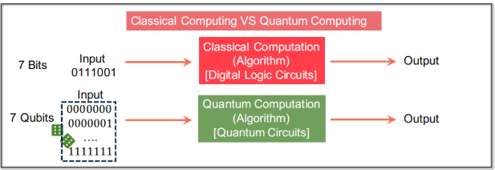

---
---
---

    <h1 style="font-size: 45px; font-family: 'Segoe UI', Tahoma, Geneva, Verdana, sans-serif; color: #e63946; background: linear-gradient(45deg, #e63946, #1d3557); -webkit-background-clip: text; color: transparent; padding: 20px 40px; border: 4px solid transparent; border-radius: 12px; background-image: linear-gradient(45deg, #e63946, #1d3557);">
        Quantum Machine Learning Tutorial
    </h1>

---
---
---

 

 

# 1. Introduction

Sejak awal revolusi industri, kekuatan komputasi telah menjadi penggerak utama perubahan besar. Awalnya, komputer hanya bisa menghitung, lalu berkembang menjadi mesin yang bisa mengendalikan proses industri, hingga kini mampu mengenali wajah dan menerjemahkan bahasa lewat kecerdasan buatan (AI).

Namun, komputer konvensional seperti CPU dan GPU kini menghadapi batasan fisik: tidak bisa terus diperkuat tanpa batas. Di sinilah komputer kuantum muncul sebagai harapan baru. Komputer ini bekerja berdasarkan prinsip-prinsip fisika kuantum, sehingga ilmu yang mempelajari dunia yang sangat kecil, seperti partikel subatom.

Dengan kemampuan unik untuk berada dalam banyak keadaan sekaligus (superposisi) dan saling terhubung walau terpisah (entanglement), komputer kuantum menjanjikan kecepatan pemrosesan yang jauh melampaui komputer biasa.

> ### Lalu apa itu kuantum machine learning ?

Quantum Machine Learning (QML) adalah gabungan dari dua dunia, yaitu komputasi kuantum dan kecerdasan buatan (AI).

Secara sederhana, QML adalah usaha untuk menggunakan komputer kuantum agar dapat menjalankan algoritma-algoritma pembelajaran (machine learning) dengan lebih cepat, efisien, atau lebih baik dibanding cara klasik. Harapannya, QML bisa menyelesaikan tugas-tugas tertentu. Misalnya prediksi cuaca, pengenalan suara, hingga pemodelan molekul dengan hasil yang lebih unggul.

Tiga unsur utama dari QML :

- Quantum Processor Otak pemroses berbasis mekanika kuantum.

- Tugas yang Spesifik Misalnya mengenali pola atau menyelesaikan persamaan.

- Keunggulan Baik dari sisi kecepatan, akurasi, atau efisiensi.

> ### Komputer Klasik vs Kuantum

Menjelaskan bahwa baik komputer klasik maupun kuantum memiliki struktur umum: ada input (data masuk), proses komputasi, dan output (hasil).
Bedanya yaitu :

- Komputer klasik pakai bit (0/1) dan gerbang logika digital.

- Komputer kuantum pakai qubit (superposisi) dan gerbang kuantum (mengatur amplitudo probabilitas).

> ### Bit vs Qubit

- Untuk 3 bit klasik → 8 kemungkinan.

- Untuk 3 qubit → bisa menyimpan dan memproses ke-8 kemungkinan secara bersamaan, dalam satu waktu.

Artinya dengan jumlah qubit yang sama, kapasitas informasi yang dibawa bisa jauh lebih besar daripada bit klasik.
Qubit mematuhi aturan tensor product, bukan perkalian biasa.

> ### Dimensi Sistem Qubit
$$
Jumlah \ kemungkinan \ sistem \ N \ Qubit = 2^N
$$
Semakin banyak qubit, jumlah keadaan yang bisa direpresentasikan bertambah secara eksponensial.  
Contoh:
- 2 qubit → 4 kemungkinan
- 3 qubit → 8 kemungkinan
- 10 qubit → 1024 kemungkinan

> ### Kuantum Volume
$$
\log_2(V_Q) = \arg \max_m \min(m, d(m))
$$

Ini adalah cara untuk mengukur kemampuan komputer kuantum secara keseluruhan.

Semakin besar VQ, semakin bagus kualitas dan skalabilitas sistem kuantum.

Nilai ini mempertimbangkan berapa banyak qubit dan seberapa dalam rangkaian (circuit) yang bisa diproses dengan benar.

> ### Empat Sektor QML

 

| Komputasi | Data    | Sektor                                        |
| --------- | ------- | --------------------------------------------- |
| Klasik    | Klasik  | CC (ML biasa)                                 |
| Klasik    | Kuantum | CQ (klasifikasi hasil eksperimen kuantum)     |
| Kuantum   | Klasik  | QC (komputasi kuantum untuk data citra/suara) |
| Kuantum   | Kuantum | QQ (pemrosesan data kuantum asli)             |

 
Gambar ini menunjukkan bahwa Quantum Machine Learning bisa diterapkan dalam banyak kombinasi — dan tutorial ini fokus pada QC dan QQ, karena di situlah komputasi kuantum benar-benar memberi perbedaan.

> ### Quantum vs Classical Neural Network

Gambar ini memperlihatkan bahwa:

Baik jaringan neural klasik maupun kuantum memiliki input → hidden layers → output.
Bedanya:
- Model klasik memakai bobot dan fungsi aktivasi.
- Model kuantum memakai gerbang kuantum dan ukurannya berupa probabilitas hasil.

> ### Peta perkembangan QML

 

**Gambar 1.3**: Menunjukkan bagaimana algoritma kuantum (seperti HHL dan QSVT) memberikan kecepatan lebih tinggi dibanding algoritma klasik.  

**Gambar 1.5**: Membandingkan kemampuan model kuantum dalam tiga aspek:
- **Expressivity**: Seberapa banyak pola yang bisa dipelajari.
- **Trainability**: Seberapa mudah dilatih (konvergensi).
- **Generalization**: Seberapa baik hasil pelatihan bisa diterapkan ke data baru.

  
 

# 2. Basic of Quantum Komputing

## 2.1 Dari Bit Klasik ke Qubit
Bit klasik hanya bisa bernilai 0 atau 1, sedangkan Qubit bisa dalam keadaan 0, 1, atau gabungan keduanya. Jika diibaratkan, Bit seperti saklar lampu hanya ON (1) atau OFF (0).Sedangkan qubit seperti gelombang cahaya: bisa berada di banyak tempat dalam satu waktu, berkat fenomena superposisi.

> ### Representasi Qubit
$$ ∣ψ⟩=α∣0⟩+β∣1⟩ $$
dengan
$$ ∣α∣^2 + ∣β∣^2 = 1 $$

- Qubit tidak hanya 0 dan 1, tapi gabungan dari keduanya.
- α dan β adalah angka kompleks (bisa dianggap sebagai "bobot"), dan jika dikuadratkan lalu dijumlahkan hasilnya harus 1
- Qubit seperti probabilitas "mengambang", jadi ketika diukur, hasilnya hanya 0 atau 1, tapi sebelumnya dia bisa "campuran" keduanya.

> ### Bola Bloch (Bloch Sphere)

Lingkaran 3D (mirip bola dunia) yang menunjukkan semua posisi kemungkinan dari satu qubit.
Titik kutub utara mewakili ∣0⟩, kutub selatan ∣1⟩, dan semua titik lain di permukaan bola adalah keadaan superposisi.

ini adalah cara memvisualisasikan semua keadaan mungkin dari satu qubit dalam ruang 3 dimensi  semakin tinggi kompleksitas posisi di bola, semakin rumit keadaan kuantumnya. Rotasi bola mewakili transformasi qubit, seperti operasi dalam sirkuit kuantum.

> ### Basis dan Notasi Dirac
- Basis Standar
$$∣0⟩ = \begin{bmatrix}1 \\ 0\end{bmatrix}, ∣1⟩ = \begin{bmatrix}0 \\ 1\end{bmatrix}$$

- Qubit
$$ ψ⟩=α \begin{bmatrix}1 \\ 0\end{bmatrix} + β \begin{bmatrix}0 \\ 1\end{bmatrix} = \begin{bmatrix}α \\ β\end{bmatrix}$$

 
 
 

---

> ### **Referensi:**

- [Quantum Machine Learning Tutorial](https://qml-tutorial.github.io/)